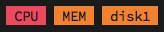

# Tmux Struggle Bus

Who needs real-time CPU percentages and sparklines and animations? I sure don’t.
Just tell me when my computer is on the struggle bus so I can go close some
tabs. That’s what this `tmux` plugin does.




## Usage

Add `#{usage_cpu}`, `#{usage_disk}`, and/or `#{usage_mem}` to your `status-left`
or `status-right`:

```
set -g status-right '#{usage_cpu}%a %Y-%m-%d %H:%M'
```

When your computer reaches a threshold of usage, an indicator will appear.
Otherwise, nothing is shown.

Currently, this plugin provides indicators for elevated CPU, disk usage, and
memory usage. Memory usage is only implemented on `Darwin` (via `sysctl`).


## Installation

1. Install [Tmux Plugin Manager][tpm].

2. Add this plugin to your `~/.tmux.conf`:

```
set -g @plugin 'chriszarate/tmux-struggle-bus'
```

3. Press [prefix] + `I` to install.


## Configuration

The following configuration variables can be set in your `~/.tmux.conf` (shown
here with their default values):

```
# Colors
set -g @usage_format_begin_warning '#[fg=black,bg=yellow]'
set -g @usage_format_begin_danger '#[fg=black,bg=red]'
set -g @usage_format_end '#[fg=white,bg=black]'

# Icons
set -g @usage_icon_cpu ' CPU '
set -g @usage_icon_disk ''
set -g @usage_icon_mem ' MEM '

# Thresholds
set -g @usage_threshold_cpu_danger '90'
set -g @usage_threshold_cpu_warning '80'
set -g @usage_threshold_disk_danger '95'
set -g @usage_threshold_disk_warning '90'
set -g @usage_threshold_mem_danger '50'
set -g @usage_threshold_mem_warning '30'
```

[tpm]: https://github.com/tmux-plugins/tpm
